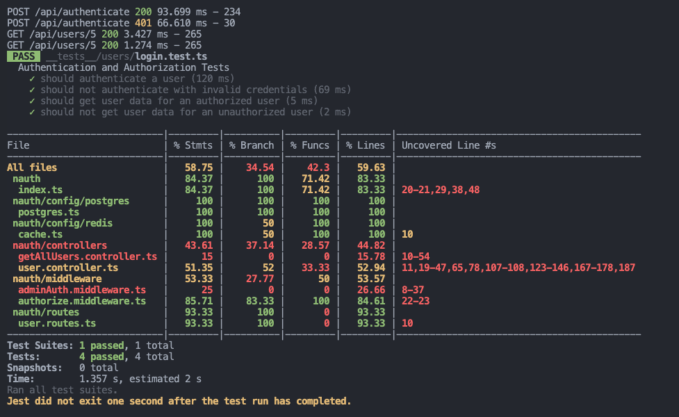
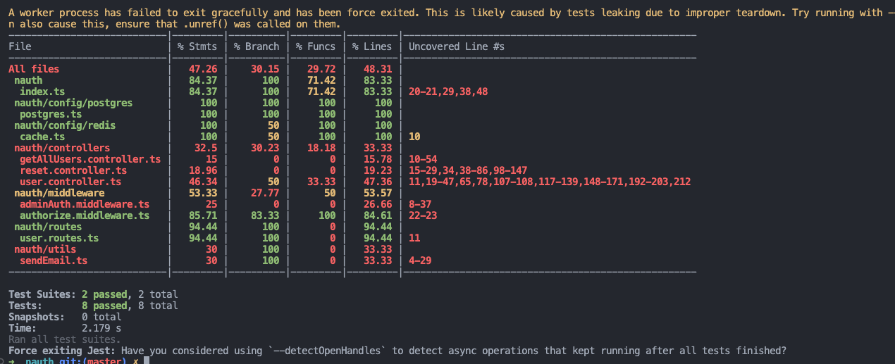
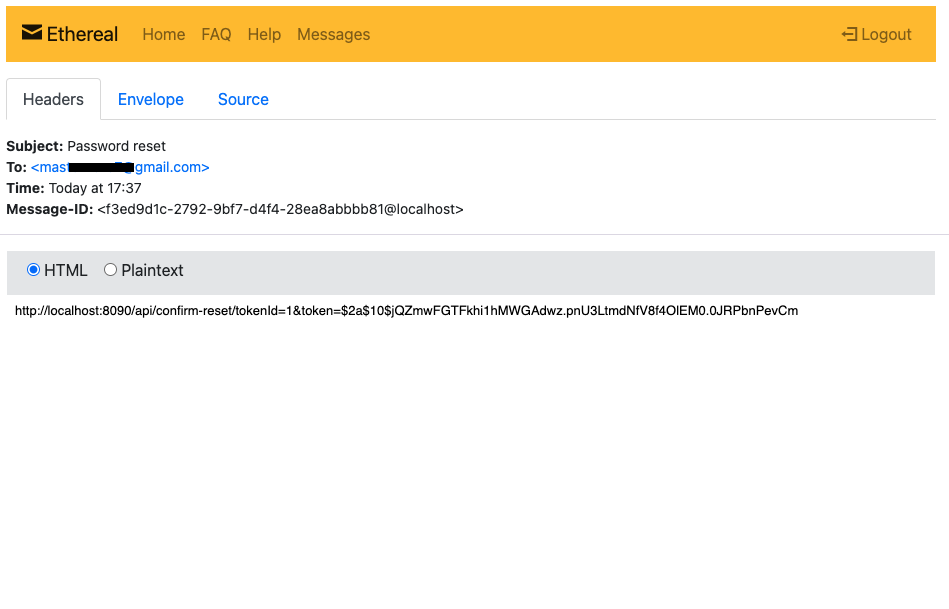

# Nauth

Authentication service in Typescript, This Application Serves a Secure User Authentication and Authorization System with Express.js and uses PostgreSQL for user store.

## Running application using `docker-compose`

```shell
docker-compose up -d
```

or

```
npm install
npm run prisma:generate
npx prisma migrate dev
npm run deploy

<!-- to start the server -->
npm run dev     # Serve on http://localhost:8090
```

## API Documentation

[Link](https://documenter.getpostman.com/view/16181974/2s9YR6ZYtw)

### Features

- [x] Create an Express.js Application
- [x] User Registration and Authentication:
  - [x] Implement user registration with email and password.
  - [x] Store user information securely, including password hashing (using libraries like `bcrypt`).
  - [x] Implement user login with token-based authentication (JWT).
  - [x] Return a JWT token upon successful login.
- [x] Secure Routes
  - [x] Create a set of routes that are protected and require a valid JWT token for access.
  - [x] Implement middleware for JWT validation to secure these routes.
- [x] User Roles and Authorization:
  - [x] Implement a basic role-based access control system with roles like "user" and "admin."
  - [x] Restrict access to certain routes based on the user's role.
  - [x] Admins should have additional permissions.
- [x] Password Reset:
  - [x] Implement a "Forgot Password" feature that allows users to reset their passwords through a secure email-based process.
- [x] Security Measures:
  - [x] Implement security headers to prevent common web security vulnerabilities (e.g., XSS, CSRF).
  - [x] Use appropriate libraries to secure against other common attacks.
- [x] Logging:
  - [x] Implement a basic logging system to record user activities and security-related events.
- [x] Testing:
  - [x] Write test cases to ensure that the authentication, authorization, and security features are working as expected.

## For Secure Routes

* To authorize middleware function that ensures secure access to routes by checking the presence and validity of an authorization token.

`/middleware/authorize.middleware.ts`
```js
const authorize = async (req, res, next) => {
  try {
    let email;

    // Check if the request contains an authorization token in the headers.
    if (
      req.headers &&
      req.headers.authorization &&
      req.headers.authorization.split(" ")[0] === "jwt"
    ) {
      // Extract the token from the "Authorization" header.
      const token = req.headers.authorization.split(" ")[1];

      // Verify and decode the token using the JWT library.
      let decode = jwt.verify(token, process.env.JWT_SECRET || "default") as IDecode;

      .
      .
      .
    // Return a 401 Unauthorized response with an error message.
    return res.status(401).json({
      message: "Unauthorized access to the API.",
    });
  }
};

```

- Secured routes `/routes/user.routes.ts`
```js
.
.
.
router.get('/users/:id', authorize, GetUser);

// Update User
router.put('/users/:id', authorize, UpdateUser);

// Delete User
router.delete('/users/:id', authorize, DeleteUser);

// Get All Users (accessible only to admins)
router.get('/users', isAdmin, GetAllUser);

```

## To achieve RBAC

Created a middleware for RBAC role-based access control, introducing roles such as `user` and `admin`.

Inside the `/middleware/adminAuth.middleware.ts`, I created a function called `isAdmin` which checks if the logged in user is admin or not.

```js
      .
      .
      .
      const token = req.headers.authorization!.split(" ")[1];
      let decode = jwt.verify(token, 
        process.env.JWT_SECRET || "default") as IDecode;
      email = decode.userEmail

      .
      .
      .

      let userRole = user?.role
      if (userRole === "admin") {
        next();
      } else {
        // User does not have admin role,
        // deny access with a 403 Forbidden response
        res.status(403).json({
          message: "Access denied: You must be an \ 
          admin privilages to access this resource",
        });
      }
    }
```

## Test Coverage





## Email `Password Reset`

- If a user forgets their `password`, they should initiate the password reset process by providing their email address.
- Once the email is provided, a link containing two crucial pieces of information, namely "`accessToken`" and "`id`," is sent to the user if their account exists.
- Using this link, the user can reset their password. To do so, they are required to provide four pieces of information: "`id`," "`accessToken`," "`password`," and "`confirmPassword`."

For sending email it uses `nodemailer` library.

```js
const transporter = nodemailer.createTransport({
  host: process.env.HOST,
  requireTLS: true,
  port: 587,
  secure: false,
  auth: {
    user: testAccount.user,
    pass: testAccount.pass,
  },
});
```

- `requireTLS: true` : Ensures that the email server is encrypted during transmission.
- Port `587` is used for sending emails securely via SMTP.



## Logging

- There are various option available for logging like `Pino`, `Morgan` `Loglevel` etc.

```js
app.use(morgan('dev'))
```

- Chose Morgan, cause its simpler, flexible and easy to use.

## Author

- [Siddhant Prateek Mahanayak](https://github.com/siddhantprateek)
